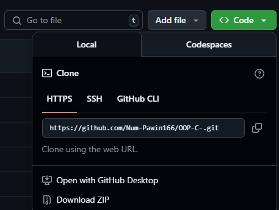

# การใช้ command line github 
- ## ครั้งแรกที่สร้าง repo ขึ้นมาถ้าต้องการให้งานขึ้นไปอยู่บน repo ใช้คำสั่งตามนี้
- ### git init
- ### git add . หรือ git add แล้วตามด้วยชื่อ ไฟล์ หรือ โฟลเดอร์
- ### git commit -m "first commit"
- ### git branch -M main
- ### git remote add origin ตามด้วย url เช่น 
- ### url ให้ดูตรงนี้ จิ้มตรง เขียวๆ แล้วก็อปมา

- ### git remote add origin www.goolge
- ### git push -u origin main
- ### หลังการใช้คำสั่ง git push -u origin main แล้วให้รี repo 1 ที เราจะเห็นไฟล์ ที่อัพขึ้นไป

# การดึงไฟล์จาก repo แล้วขึ้นอัพขึ้นให้หมด
- ## กรณีที่รอบแรกดึงมาจาก docker แล้วต่อไปจะเอาไฟล์ในเครื่องเข้า repo ที่เอามาจาก docker ให้ทำตามนี้
- ### git init 
- ### git add .
- ### git commit -m "first"
- ### git remote add origin ตามด้วย url ของ repo เรา
- ### git branch -M main
- ### git pull origin main 
- ### git push -u origin main --force จะเขียนทับของเก่าทั้งหมดใน GitHub โปรดใช้ด้วยความระวัง
- ### --force จะใช้หรือไม่ใช้ให้ดูตามความเหมาะสม

# ส่วน git clone 

ต้องการทำอะไร | ใช้ git clone ไหม |
----- | ----- |
ดึง repo จาก GitHub มาทำงานต่อ | ใช้ได้เลย |
สร้าง repo ใหม่จากไฟล์ในเครื่อง	| ใช้ git init |
ร่วมทีมเพื่อพัฒนาโปรเจกต์เดิม	| ใช้ได้เลย |
เขียนทับไฟล์ใน GitHub ด้วยของในเครื่อง	|  ใช้ git push --force |